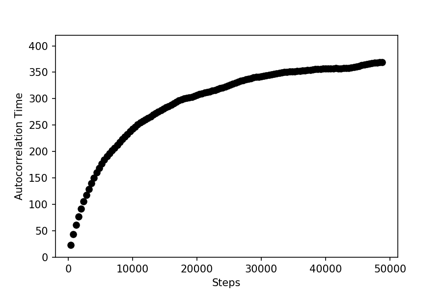
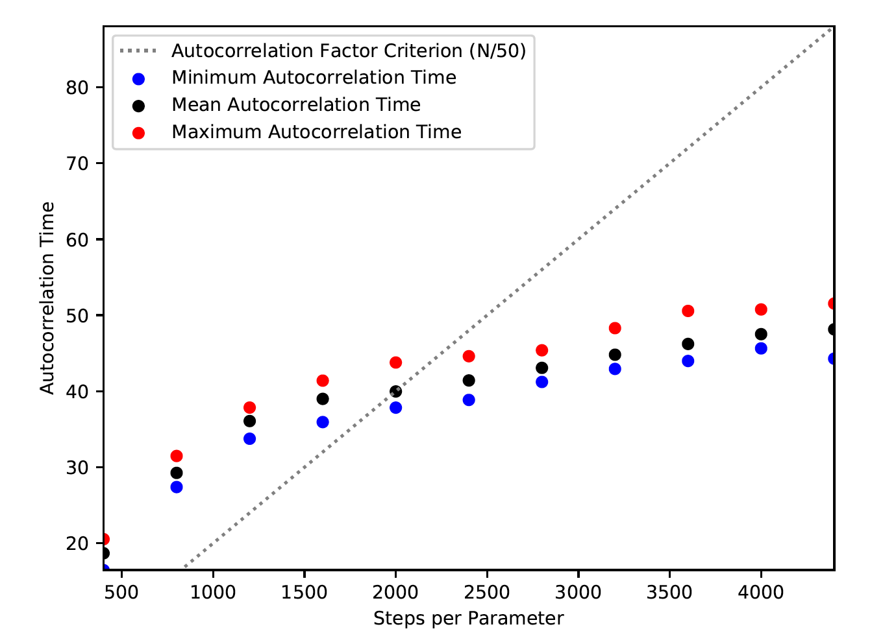

.. _autocorrintro:

Introduction to Autocorrelation Times
===============

.. _background:

Background
++++++++++++

There are two additional criterion to maxGR and minTz used to evaluate whether or not MCMC chains have converged,
ultimately halting the run: minAfactor and maxArchange. Both rely on autocorrelation time. While a more in-depth
explanation of autocorrelation and its relation to convergence can be found in the
`documentation for emcee <https://emcee.readthedocs.io/en/stable/tutorials/autocorr/>`_, we will provide a brief
description.

Autocorrelation time is the number of steps the walker needs to take for the chain to "forget" its initial position.
Therefore, it can be used to reduce the error in your MCMC and tell if it is well-mixed. Using ``emcee``, we can
estimate this value for each parameter in an ensemble; if multiple ensembles are run, we combine their chains to receive
the autocorrelation times.

As the chain progresses, the estimated value of the autocorrelation time (τ) becomes more accurate. In the plot below,
you can see that the the estimated autocorrelation time quickly rises and then begins to plateau as it nears the true
value.

minAfactor
+++++++++++

The MCMC chains typically converge once the chains have reached large enough of a size; the autocorrelation time can be
used to evaluate whether or not a chain is sufficiently large enough to be well-mixed. Therefore, if N steps have been
taken, N/τ ≥ c, where c is what we call the autocorrelation factor. The minimum autocorrelation factor to consider the
chains converged is represented by the criterion minAfactor. The default value for minAfactor is 50, however we find
that lower values may be sufficient, particularly for runs that take a long time; alternate values can be specified
using the minAfactor argument when calling the MCMC.

The autocorrelation factor is calculated for each parameter as the MCMC runs, and the minimum of these values
is returned in real time as it progresses. Once the minimum autocorrelation factor is below minAfactor, this criterion
for convergence is met. Whether or not minAfactor has been satisfied can be seen in the auto plot below. Once the
maximum autocorrelation time has passed the dashed line labeled 'Autocorrelation Factor Criterion,' the chain is
beginning to converge. After five consecutive points appear past the dashed line, the MCMC will halt given all other
criterion have been met.

maxArchange
+++++++++++++++++

While we want the autocorrelation factor to be sufficiently large, we want to make sure that it is being calculated with
an accurate estimate of the autocorrelation time. We know our estimate for τ is accurate once it begins to plateau,
allowing us to use the relative change in the autocorrelation time to infer whether or not the estimate is reliable.
We calculate the relative change in autocorrelation time for each parameter between every convergence check. The largest
of these values is also returned in real time and for the chain to be considered converged, must fall below the
criterion maxArchange.

The default value for maxArchange is .07, where we consider the autocorrelation time to begin leveling. Rarely should
you need to increase the maxArchange argument when calling the MCMC, however, for more conservative criterion, you may
want to decrease it, particularly for long chains with large autocorrelation times (in such cases, the relative change
may be small, but τ has not reached its plateau).