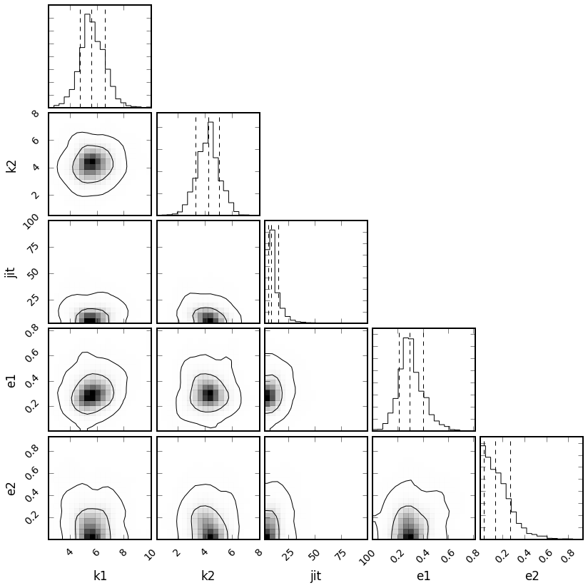

K2-24 Fitting & MCMC
--------------------

Using the K2-24 (EPIC-203771098) dataset, we demonstrate how to use the
``radvel`` API to:

-  perform a max-likelihood fit
-  do an MCMC exploration of the posterior space
-  plot the results

Perform some preliminary imports:

.. code:: python
    
    import os
    
    import matplotlib
    import numpy as np
    import pylab as pl
    import pandas as pd
    from scipy import optimize
    
    import corner
    
    import radvel
    import radvel.plotting
    
Define a function that we will use to initialize the
``radvel.RVParameters`` and ``radvel.RVModel`` objects

.. code:: python

    def initialize_model():
        time_base = 2420
        params = radvel.RVParameters(2,basis='per tc secosw sesinw logk')
        params['per1'] = planet.ix['P','b']
        params['tc1'] = planet.ix['t0','b']
        params['secosw1'] = 0.01
        params['sesinw1'] = 0.01
        params['logk1'] = 1.1
        params['per2'] = planet.ix['P','c']
        params['tc2'] = planet.ix['t0','c']
        params['secosw2'] = 0.01
        params['sesinw2'] = 0.01
        params['logk2'] = 1.1
        mod = radvel.RVModel(params, time_base=time_base)
        mod.params['dvdt'] = -0.02
        mod.params['curv'] = 0.01
        return mod

Define a simple plotting function to display the data, model, and
residuals

.. code:: python

    def plot_results(like):
        fig = pl.figure(figsize=(12,4))
        fig = pl.gcf()
        pl.errorbar(
            like.x, like.model(t)+like.residuals(), 
            yerr=like.yerr, fmt='o'
            )
        pl.plot(ti, like.model(ti))
        fig.set_tight_layout(True)
        pl.xlabel('Time')
        pl.ylabel('RV')
        pl.draw()

Load up the K2-24 data. In this example the RV data and parameter
starting guesses are stored in an HD5 file

.. code:: python

    path = os.path.join(radvel.DATADIR,'epic203771098.hdf')
    planet = pd.read_hdf(path,'planet')
    rv = pd.read_hdf(path,'rv')
    
    t = np.array(rv.t)
    vel = np.array(rv.vel)
    errvel = rv.errvel
    ti = np.linspace(rv.t.iloc[0]-5,rv.t.iloc[-1]+5,100)

Circular Orbits
~~~~~~~~~~~~

Set initial guesses for the parameters

.. code:: python

    mod = initialize_model()
    like = radvel.likelihood.RVLikelihood(mod, t, vel, errvel)
    like.params['gamma'] = 0.1
    like.params['jit'] = 1.0

Choose which parameters to vary or fix

.. code:: python

    like.vary['secosw1'] = False
    like.vary['sesinw1'] = False
    like.vary['secosw2'] = False
    like.vary['sesinw2'] = False
    like.vary['per1'] = False
    like.vary['per2'] = False
    like.vary['tc1'] = False
    like.vary['tc2'] = False
    like.vary['curv'] = True
    print like

.. parsed-literal::

    parameter                     value      vary
    curv                           0.01       True
    dvdt                          -0.02       True
    gamma                           0.1       True
    jit                               1       True
    logk1                           1.1       True
    logk2                           1.1       True
    per1                        20.8851      False
    per2                        42.3638      False
    secosw1                        0.01      False
    secosw2                        0.01      False
    sesinw1                        0.01      False
    sesinw2                        0.01      False
    tc1                    -2.44793e+06      False
    tc2                    -2.44792e+06      False
    

Plot the initial model

.. code:: python

    pl.figure()
    plot_results(like)

.. image:: plots/output_14_2.png

Well that solution doesn't look very good. Now lets try to optimize the
parameters set to vary by maximizing the likelihood.

Initialize a ``radvel.Posterior`` object and add some priors

.. code:: python

    post = radvel.posterior.Posterior(like)
    post.priors += [radvel.prior.Gaussian( 'jit', np.log(3), 0.5)]
    post.priors += [radvel.prior.Gaussian( 'logk2', np.log(5), 10)]
    post.priors += [radvel.prior.Gaussian( 'logk1', np.log(5), 10)]
    post.priors += [radvel.prior.Gaussian( 'gamma', 0, 10)]

Maximize the likelihood and print the updated posterior object

.. code:: python

    res  = optimize.minimize(
        post.neglogprob_array,     # objective function is negative log likelihood
        post.get_vary_params(),    # initial variable parameters
        method='Powell',           # Nelder-Mead also works
        )
    
    plot_results(like)             # plot best fit model
    print post

.. parsed-literal::

    parameter                     value      vary
    curv                       0.001804       True
    dvdt                     -0.0299544       True
    gamma                      -3.97918       True
    jit                         2.06908       True
    logk1                        1.5468       True
    logk2                       1.37737       True
    per1                        20.8851      False
    per2                        42.3638      False
    secosw1                        0.01      False
    secosw2                        0.01      False
    sesinw1                        0.01      False
    sesinw2                        0.01      False
    tc1                    -2.44793e+06      False
    tc2                    -2.44792e+06      False
    Priors
    ------
    Gaussian prior on jit, mu=1.09861228867, sigma=0.5
    Gaussian prior on logk2, mu=1.60943791243, sigma=10
    Gaussian prior on logk1, mu=1.60943791243, sigma=10
    Gaussian prior on gamma, mu=0, sigma=10
    

.. image:: plots/output_18_1.png

That looks much better!

Now lets use Markov-Chain Monte Carlo (MCMC) to estimate the parameter
uncertainties. In this example we will run 1000 steps for the sake of
speed but in practice you should let it run at least 10000 steps and ~50
walkers. If the chains converge before they reach the maximum number of
allowed steps it will automatically stop.

.. code:: python

    df = radvel.mcmc(post,nwalkers=20,nrun=1000)

Make a corner plot to display the posterior distributions.

.. code:: python

    radvel.plotting.corner_plot(post, df)

.. image:: plots/output_22_0.png

Eccentric Orbits
~~~~~~~~~~~~~

Allow ``secosw`` and ``sesinw`` parameters to vary

.. code:: python

    like.vary.update(secosw1=True,
                     sesinw1=True,
                     secosw2=True,
                     sesinw2=True)

Add an ``EccentricityPrior`` to ensure that eccentricity stays below
1.0. In this example we will also add a Gaussian prior on the jitter
(``jit``) parameter with a center at 2.0 m/s and a width of 0.1 m/s.

.. code:: python

    post = radvel.posterior.Posterior(like)
    post.priors += [radvel.prior.EccentricityPrior( 2 )]
    post.priors += [radvel.prior.Gaussian( 'jit', np.log(2), np.log(0.1))]

Optimize the parameters by maximizing the likelihood and plot the result

.. code:: python

    res  = optimize.minimize(
        post.neglogprob_array, 
        post.get_vary_params(), 
        method='Nelder-Mead',)
    
    plot_results(like)
    print post

.. parsed-literal::

    parameter                     value      vary
    curv                     0.00189763       True
    dvdt                      -0.030585       True
    gamma                      -4.45199       True
    jit                         1.89795       True
    logk1                       1.69415       True
    logk2                       1.49037       True
    per1                        20.8851      False
    per2                        42.3638      False
    secosw1                    0.416534       True
    secosw2                   -0.157138       True
    sesinw1                   -0.326439       True
    sesinw2                  -0.0489288       True
    tc1                    -2.44793e+06      False
    tc2                    -2.44792e+06      False
    Priors
    ------
    Eccentricity constrained to be < 0.99
    Gaussian prior on jit, mu=0.69314718056, sigma=-2.30258509299
    

.. image:: plots/output_28_1.png

Run the MCMC again

.. code:: python

    df = radvel.mcmc(post,threads=1,nwalkers=20,nrun=1000)

Convert into more physical parameters and make another corner plot

.. code:: python

    df['k1'] = np.exp(df['logk1'])
    df['k2'] = np.exp(df['logk2'])
    df['jit'] = np.exp(df['jit'])
    df['e1'] = df['secosw1']**2 + df['sesinw1']**2
    df['e2'] = df['secosw2']**2 + df['sesinw2']**2
    
    df['ecosw1'] = df['secosw1']*np.sqrt(df['e1'])
    df['esinw1'] = df['sesinw1']*np.sqrt(df['e1'])
    
    df['ecosw2'] = df['secosw2']*np.sqrt(df['e2'])
    df['esinw2'] = df['sesinw2']*np.sqrt(df['e2'])
    
    
    labels = 'k1 k2 jit e1 e2'.split()
    fig = corner.corner(
        df[labels],
        labels=labels,
        levels=[0.68,0.95],
        plot_datapoints=False,
        smooth=True,
        bins=20,
        quantiles=[.14,.5,.84]
        )

Plot the final solution

.. code:: python

    radvel.plotting.rv_multipanel_plot(post)

.. image:: plots/output_34_0.png

