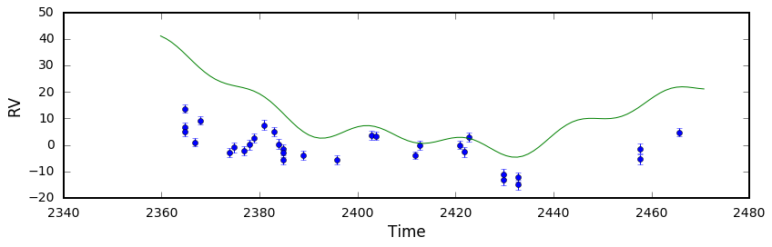
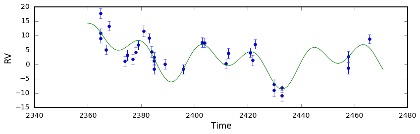
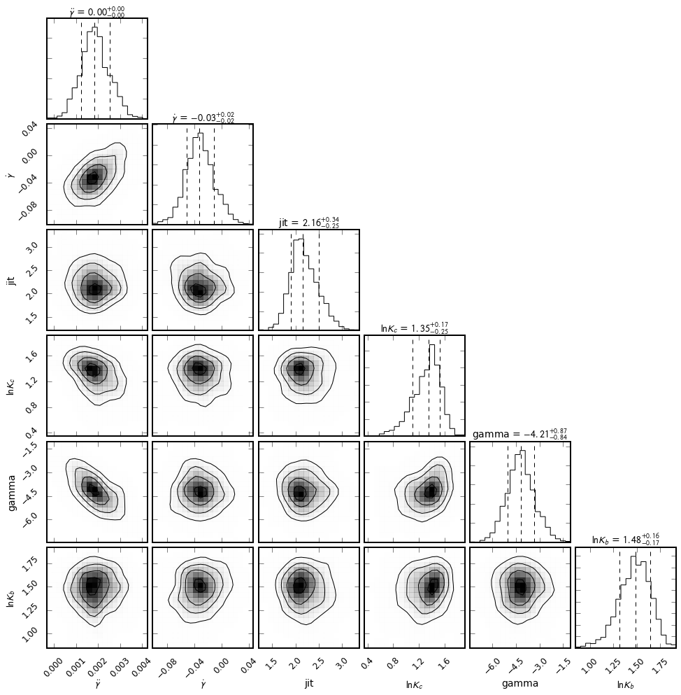
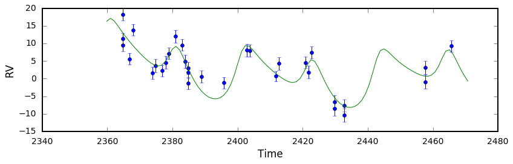
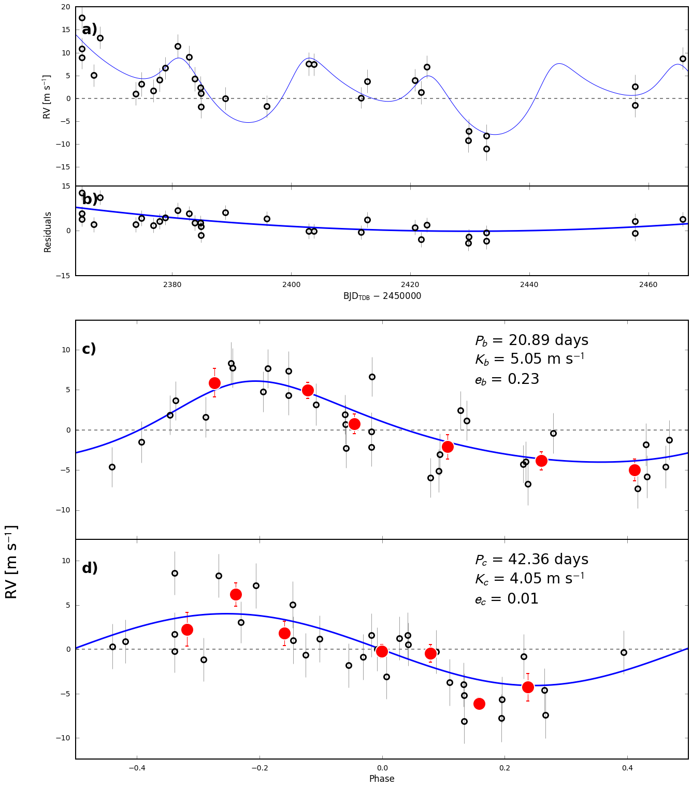

K2-24 Fitting & MCMC
--------------------

Using the K2-24 (EPIC-203771098) dataset, we demonstrate how to use the
``radvel`` API to:

-  perform a max-likelihood fit
-  do an MCMC exploration of the posterior space
-  plot the results

Perform some preliminary imports:

.. code:: python
    
    import os

    import matplotlib
    import numpy as np
    import pylab as pl
    import pandas as pd
    from scipy import optimize

    import corner

    import radvel
    import radvel.plotting
    
Define a function that we will use to initialize the
``radvel.Parameters`` and ``radvel.RVModel`` objects

.. code:: python

    def initialize_model():
        time_base = 2420
        params = radvel.Parameters(2,basis='per tc secosw sesinw logk') # number of planets = 2
        params['per1'] = radvel.Parameter(value=20.885258)
        params['tc1'] = radvel.Parameter(value=2072.79438)
        params['secosw1'] = radvel.Parameter(value=0.01)
        params['sesinw1'] = radvel.Parameter(value=0.01)
        params['logk1'] = radvel.Parameter(value=1.1)
        params['per2'] = radvel.Parameter(value=42.363011)
        params['tc2'] = radvel.Parameter(value=2082.62516)
        params['secosw2'] = radvel.Parameter(value=0.01)
        params['sesinw2'] = radvel.Parameter(value=0.01)
        params['logk2'] = radvel.Parameter(value=1.1)
        mod = radvel.RVModel(params, time_base=time_base)
        mod.params['dvdt'] = radvel.Parameter(value=-0.02)
        mod.params['curv'] = radvel.Parameter(value=0.01)
        return mod

Define a simple plotting function to display the data and model.

.. code:: python

    def plot_results(like):
        fig = pl.figure(figsize=(12,4))
        fig = pl.gcf()
        fig.set_tight_layout(True)
        pl.errorbar(
            like.x, like.model(t)+like.residuals(),
            yerr=like.yerr, fmt='o'
            )
        pl.plot(ti, like.model(ti))
        pl.xlabel('Time')
        pl.ylabel('RV')
        pl.draw()

Load up the K2-24 data. In this example the RV data is stored in an CSV file

.. code:: python

    path = os.path.join(radvel.DATADIR,'epic203771098.csv')
    rv = pd.read_csv(path)

    t = np.array(rv.t)
    vel = np.array(rv.vel)
    errvel = rv.errvel
    ti = np.linspace(rv.t.iloc[0]-5,rv.t.iloc[-1]+5,100)

Circular Orbits
~~~~~~~~~~~~

Use the function we just defined to initialize a model object and add a few additional parameters
into the ``radvel.likelihood.Likelihood`` object that are not associated with the Keplerian orbital model
but still needed to calculate a likelihood.

.. code:: python

    mod = initialize_model()
    like = radvel.likelihood.RVLikelihood(mod, t, vel, errvel)
    like.params['gamma'] = radvel.Parameter(value=0.1)
    like.params['jit'] = radvel.Parameter(value=1.0)

Choose which parameters to vary or fix. By default, all ``radvel.Parameter`` objects will vary,
so you only have to worry about setting the ones you want to hold fixed.

.. code:: python

    like.params['secosw1'].vary = False
    like.params['sesinw1'].vary = False
    like.params['secosw2'].vary = False
    like.params['sesinw2'].vary = False
    like.params['per1'].vary = False
    like.params['per2'].vary = False
    like.params['tc1'].vary = False
    like.params['tc2'].vary = False
    print(like)

.. parsed-literal::

    parameter                     value      vary
    per1                        20.8853      False
    tc1                         2072.79      False
    secosw1                        0.01      False
    sesinw1                        0.01      False
    logk1                           1.1       True
    per2                         42.363      False
    tc2                         2082.63      False
    secosw2                        0.01      False
    sesinw2                        0.01      False
    logk2                           1.1       True
    dvdt                          -0.02       True
    curv                           0.01       True
    gamma                           0.1       True
    jit                               1       True

Plot the initial model

.. code:: python

    pl.figure()
    plot_results(like)

Well that solution doesn't look very good. Now lets try to optimize the
parameters set to vary by maximizing the likelihood.

Initialize a ``radvel.Posterior`` object and add some priors

.. code:: python

    post = radvel.posterior.Posterior(like)
    post.priors += [radvel.prior.Gaussian( 'jit', np.log(3), 0.5)]
    post.priors += [radvel.prior.Gaussian( 'logk2', np.log(5), 10)]
    post.priors += [radvel.prior.Gaussian( 'logk1', np.log(5), 10)]
    post.priors += [radvel.prior.Gaussian( 'gamma', 0, 10)]

Maximize the likelihood and print the updated posterior object

.. code:: python

    res  = optimize.minimize(
        post.neglogprob_array,     # objective function is negative log likelihood
        post.get_vary_params(),    # initial variable parameters
        method='Powell',           # Nelder-Mead also works
        )

    plot_results(like)             # plot best fit model
    print(post)

.. parsed-literal::

    parameter                     value      vary
    per1                        20.8853      False
    tc1                         2072.79      False
    secosw1                        0.01      False
    sesinw1                        0.01      False
    logk1                       1.56037       True
    per2                         42.363      False
    tc2                         2082.63      False
    secosw2                        0.01      False
    sesinw2                        0.01      False
    logk2                       1.80937       True
    dvdt                     -0.0364432       True
    curv                    -0.00182455       True
    jit                         2.62376       True
    gamma                       2.62376       True

    Priors
    ------
    Gaussian prior on jit, mu=1.09861228867, sigma=0.5
    Gaussian prior on logk2, mu=1.60943791243, sigma=10
    Gaussian prior on logk1, mu=1.60943791243, sigma=10
    Gaussian prior on gamma, mu=0, sigma=10

That looks much better!

Now lets use Markov-Chain Monte Carlo (MCMC) to estimate the parameter
uncertainties. In this example we will run 1000 steps for the sake of
speed but in practice you should let it run at least 10000 steps and ~50
walkers. If the chains converge before they reach the maximum number of
allowed steps it will automatically stop.

.. code:: python

    df = radvel.mcmc(post,nwalkers=20,nrun=1000)

Make a corner plot to display the posterior distributions.

.. code:: python

    radvel.plotting.corner_plot(post, df)

Eccentric Orbits
~~~~~~~~~~~~~

Allow ``secosw`` and ``sesinw`` parameters to vary

.. code:: python

    like.params['secosw1'].vary = True
    like.params['sesinw1'].vary = True
    like.params['secosw2'].vary = True
    like.params['sesinw2'].vary = True

Add an ``EccentricityPrior`` to ensure that eccentricity stays below
1.0. In this example we will also add a Gaussian prior on the jitter
(``jit``) parameter with a center at 2.0 m/s and a width of 0.1 m/s.

.. code:: python

    post = radvel.posterior.Posterior(like)
    post.priors += [radvel.prior.EccentricityPrior( 2 )]
    post.priors += [radvel.prior.Gaussian( 'jit', np.log(2), np.log(0.1))]

Optimize the parameters by maximizing the likelihood and plot the result

.. code:: python

    res  = optimize.minimize(
        post.neglogprob_array, 
        post.get_vary_params(), 
        method='Nelder-Mead',)

    plot_results(like)
    print(post)

.. parsed-literal::

    parameter                     value      vary
    per1                        20.8853      False
    tc1                         2072.79      False
    secosw1                    0.389104       True
    sesinw1                    0.059227       True
    logk1                       1.65139       True
    per2                         42.363      False
    tc2                         2082.63      False
    secosw2                    0.194769       True
    sesinw2                   -0.422685       True
    logk2                        1.6278       True
    dvdt                      -0.027433       True
    curv                     0.00152703       True
    gamma                      -4.38996       True
    jit                          2.2025       True

    Priors
    ------
    e1 constrained to be < 0.99
    e2 constrained to be < 0.99
    Gaussian prior on jit, mu=0.6931471805599453, sigma=-2.3025850929940455

Plot the final solution

.. code:: python

    radvel.plotting.rv_multipanel_plot(post)

