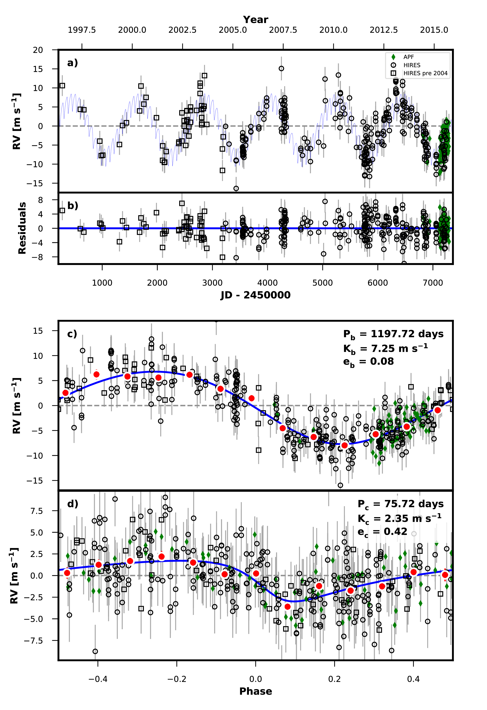

.. _quickstartcli:

Getting Started
===============

.. _installation:

Installation
++++++++++++

While it is possible to install ``radvel`` inside a minimal Python environment like that built-in to Mac OSX,
we recommend first installing a scientific Python environment such as
`Anaconda <https://www.anaconda.com/distribution/>`_ or `Miniconda <https://docs.conda.io/en/latest/miniconda.html>`_.

Install ``radvel`` using pip:

.. code-block:: bash

    $ pip install radvel

Make sure that ``pdflatex`` is installed and in your system's path. 
You can get ``pdflatex`` by installing the `TexLive package
<https://www.tug.org/texlive/>`_ or other LaTeX distributions.
By default it is expected to be in your system's path, but you may
specify a path to pdflatex using the ``--latex-compiler``
option at the ``radvel report`` step.

If you are running OSX, and want to perform Gaussian Process likelihood
computations in parallel, you may need to perform some additional
installation steps. See :ref:`OSX-multiprocessing`.

If you wish to use the celerite GP kernels you will also need to install celerite.
See the `celerite install instructions <http://celerite.readthedocs.io/en/stable/python/install/#using-pip>`_.

Example Fit
+++++++++++

Test your installation by running through one of the included
examples. We will use the ``radvel`` command line interface to execute
a multi-planet, multi-instrument fit.

The ``radvel`` binary should have been automatically placed in your system's path by the
``pip`` command (see :ref:`installation`). If your system can not find
the ``radvel`` executable then try running ``python setup.py install``
from within the top-level ``radvel`` directory.

First lets look at ``radvel --help`` for the available options:

.. code-block:: bash
		
    $ radvel --help
    usage: RadVel [-h] [--version] {fit,plot,mcmc,derive,bic,table,report} ...

    RadVel: The Radial Velocity Toolkit

    optional arguments:
      -h, --help            show this help message and exit
      --version             Print version number and exit.

    subcommands:
      {fit,plot,mcmc,derive,bic,table,report}

Here is an example workflow to
run a simple fit using the included `HD164922.py` example
configuration file. This example configuration file can be found in the ``example_planets``
subdirectory on the `GitHub repository page
<https://github.com/California-Planet-Search/radvel/tree/master/example_planets>`_.

Perform a maximum-likelihood fit. You almost always will need to do this first:

.. code-block:: bash

    $ radvel fit -s /path/to/radvel/example_planets/HD164922.py

   
By default the results will be placed in a directory with the same name as
your planet configuration file (without `.py`, e.g. `HD164922`). You
may also specify an output directory using the ``-o`` flag.

After the maximum-likelihood fit is complete the directory should have been created
and should contain one new file:
`HD164922/HD164922_post_obj.pkl`. This is a ``pickle`` binary file
that is not meant to be human-readable but lets make a plot of the
best-fit solution contained in that file:

.. code-block:: bash

    $ radvel plot -t rv -s /path/to/radvel/example_planets/HD164922.py

This should produce a plot named
`HD164922_rv_multipanel.pdf` that looks something like this.

Next lets perform the Markov-Chain Monte Carlo (MCMC) exploration to
assess parameter uncertainties.

.. code-block:: bash

    $ radvel mcmc -s /path/to/radvel/example_planets/HD164922.py

Once the MCMC chains finish running there will be another new file
called `HD164922_mcmc_chains.csv.tar.bz2`. This is a compressed csv
file containing the parameter values and likelihood at each step in
the MCMC chains.

Now we can update the RV time series plot with the MCMC
results and generate the full suite of plots.

.. code-block:: bash

    $ radvel plot -t rv corner trend -s /path/to/radvel/example_planets/HD164922.py

We can summarize our analysis with the `radvel report` command.

.. code-block:: bash

    $ radvel report -s /path/to/radvel/example_planets/HD164922.py

whihc creates a LaTeX document and corresponding PDF to summarize the
results. Note that this command assembles values and plots that have been computed 
through other commands, if you want to update, rerun the previous commands before 
reruning `radvel report`

The report PDF will be saved as `HD164922_results.pdf`. It should
contain a table reporting the parameter values and uncertainties, a
table summarizing the priors, the RV time-series plot, and a corner
plot showing the posterior distributions for all free parameters.

Optional Features
+++++++++++++++++

Combine the measured properties of the RV time-series with
the properties of the host star defined in the setup file to
derive physical parameters for the planetary system. Have a look at the
`epic203771098.py` example setup file to see how to include stellar parameters.

.. code-block:: bash

    $ radvel derive -s /path/to/radvel/example_planets/HD164922.py

Generate a corner plot for the derived parameters. This plot will also be
included in the summary report if available.

.. code-block:: bash

    $ radvel plot -t derived -s /path/to/radvel/example_planets/HD164922.py

Perform a model comparison testing models eliminating different sets of
planets, their eccentricities, and RV trends. If this is run a new table 
will be included in the summary report.

.. code-block:: bash

    $ radvel ic -t nplanets e trend -s /path/to/radvel/example_planets/HD164922.py

Generate and save only the TeX code for any/all of the tables.

.. code-block:: bash

    $ radvel table -t params priors ic_compare derived -s /path/to/radvel/example_planets/HD164922.py

